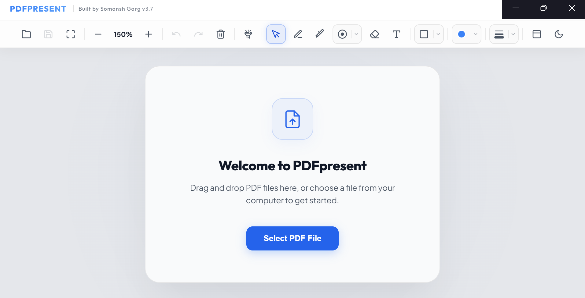
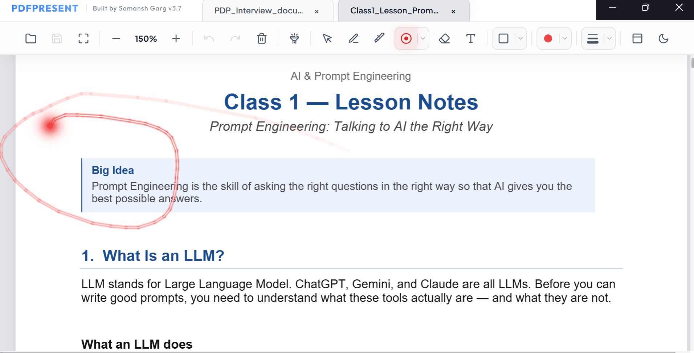
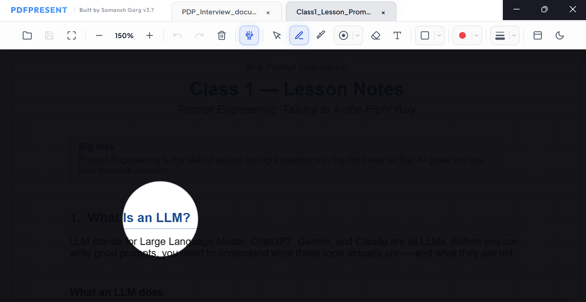
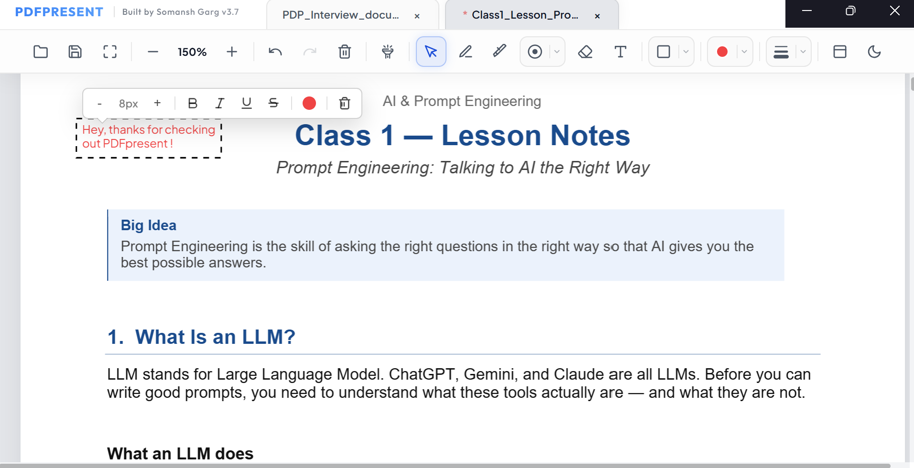

# PDF Present

**A free, clean PDF viewer built for presentations — no ads, no paywall, no distractions.**

Most PDF readers are either paid, cluttered with ads, or completely lack the tools you actually need when presenting in front of an audience. PDF Present is built specifically for that moment — when you're in front of a room and need your slides to look sharp and your tools to work instantly.

---

## ✨ Features

- **Laser Pointer** — Highlight exactly what you're talking about, just like a physical pointer
- **Flashlight / Focus Mode** — Dim the rest of the slide and spotlight a specific area to keep your audience locked in
- **Annotation / Scratchpad** — Draw, underline, or write directly on your PDF during the presentation
- **Clean, Distraction-Free Interface** — No banner ads, no upgrade popups, no bloat
- **Completely Free** — No trial period, no hidden features behind a paywall

---

## 📥 Download

Head to the [**Releases**](../../releases) page and download the latest `.exe` file.

> No installation needed — just download and run.

---

## 🖥️ System Requirements

- **OS**: Windows 10 or later
- **RAM**: 2 GB minimum
- **Storage**: ~450 MB free space

---

## 🚀 Getting Started

1. Download `PDF-Present-v3.7-Setup.exe` from the [Releases](../../releases) page
2. Double-click to run — no installation wizard needed
3. Open your PDF and switch to Presentation Mode
4. Use the toolbar to activate the laser pointer, flashlight, or annotation tools

---

## 🙋 Why I Built This

I needed a simple tool to present PDFs without the usual friction — ads, paywalls, or features buried behind subscriptions. So I built one. PDF Present is free, always will be, and focused entirely on making your presentations smoother.

---

## 📸 Screenshots

---

## 📬 Feedback & Issues

Found a bug? Have a feature request? Open an [Issue](../../issues) — I'd love to hear from you.

---

## 🪪 License

MIT License — free to use, modify, and share.
